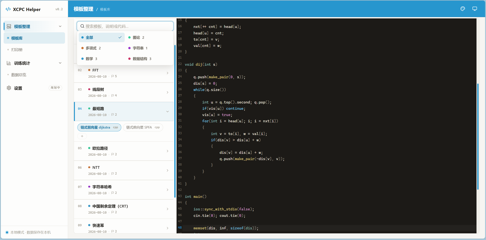
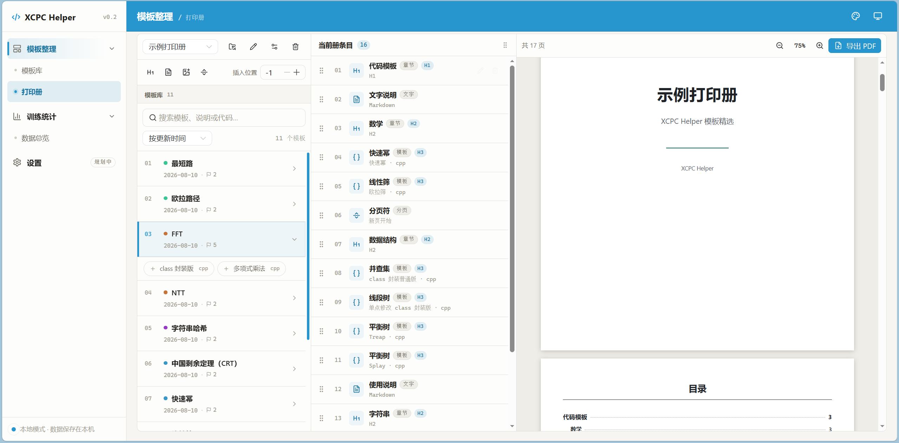
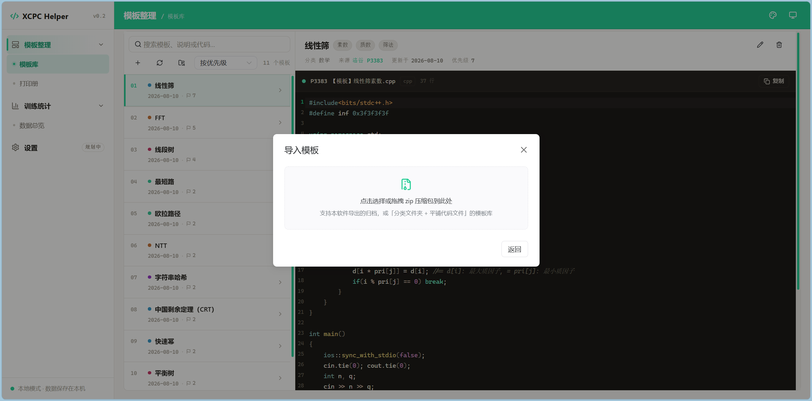
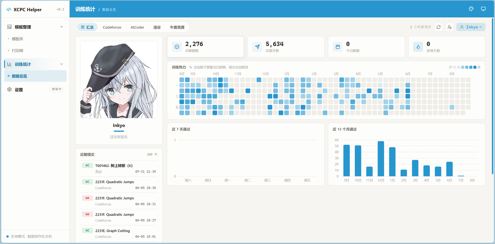

<h1>XCPC Helper</h1>

算竞选手的本地辅助工具

 

---

## 🚀 功能一览

我们致力于为算法竞赛选手提供强大、便捷的服务。

- **模板库**：组织你的算法模板，支持分类筛选、快速检索、代码预览、挂载说明文档，告别在目录树中翻找模板的日子吧。
- **打印册**：将你的模板拖进册子，和章节、自由文字、图片组合排版，实时预览分页效果，一键导出 PDF——线下赛允许携带的纸质资料就靠它了。
- **训练统计**：整合你在各平台散落的训练数据，展示数据统计卡片、训练热力图、近期提交，一站式查阅你的整体训练情况。目前支持 CF / ATC / 洛谷 / 牛客竞赛 / LeetCode CN / VJudge / QOJ。

✨ 本地运行、离线可用、数据都在你自己电脑上，无需注册登录。

🧪 目前，项目还在开发初期阶段，我们会在后续更新更多更好的功能。

## 📸 画面演示

<table width="100%">
  <tr>
    <td align="center" width="50%">
      <h4>📘 整理你的模板</h4>
    </td>
    <td align="center" width="50%">
      <h4>📜 预览并生成打印册</h4>
    </td>
  </tr>
  <tr>
    <td align="center" width="50%">
      
    </td>
    <td align="center" width="50%">
      
    </td>
  </tr>
  <tr>
    <td align="center" width="50%">
      <h4>📥 快速导出/导入本地内容</h4>
    </td>
    <td align="center" width="50%">
      <h4>📊 查阅你的汇总训练数据</h4>
    </td>
  </tr>
  <tr>
    <td align="center" width="50%">
      
    </td>
    <td align="center" width="50%">
      
    </td>
  </tr>
</table>

## 📋 系统要求

- **Windows**：Windows 10 及以上（64 位）
- **macOS**：macOS 12 及以上（Apple Silicon / Intel）
- **Linux**：主流发行版（glibc 2.31+）

> 首次启动需要联网下载 Python 运行时与依赖（约 200MB），之后可完全离线使用。

## 🔧 快速上手

无需安装任何环境，Windows / Linux / macOS 均可：

1. 在本仓库的 [Releases](https://github.com/Inkyo-007/xcpc-helper/releases/latest) 页面下载对应平台的最新压缩包；
2. 解压到任意目录；
3. 启动：Windows 双击解压目录中的 `start.bat`，Linux/macOS 在解压目录执行 `./start.sh`。首次运行会自动下载 Python 与依赖（需要联网，约几分钟）；
4. 完成后，按窗口提示，在浏览器访问 <http://127.0.0.1:8000>。

## 🗺️ 开发计划

- [x] 模板库管理与打印册导出
- [x] 训练统计（Codeforces / AtCoder / 洛谷 / 牛客）
- [x] 更多平台适配（LeetCode CN / VJudge / QOJ）
- [ ] 训练统计引入 rating 折线图
- [ ] 在线比赛信息聚合
- [ ] Agent 接入

## 🖥️ 反馈与贡献

XCPC Helper 还在持续成长中，你的声音对我们非常重要。

- **遇到问题、有功能想法，或想报告 Bug？** 请到 [Issues](https://github.com/Inkyo-007/xcpc-helper/issues) 页面告诉我们。为了让我们能更高效地帮助你，建议先阅读 [CONTRIBUTING.md](./CONTRIBUTING.md)。
- **想参与代码贡献？** 无论是修复 Bug、开发新功能，还是改进文档，我们都由衷欢迎。详细的参与方式请阅读 [CONTRIBUTING.md](./CONTRIBUTING.md)。

> 💡 本项目在开发过程中使用了 AI 辅助工具，如果你在体验中发现了不够完善的地方，非常欢迎在 Issues 中指出，帮助我们做得更好。

## 🔗 致谢与灵感来源

本项目的实现离不开社区强大的开源作者们，对这些优秀作品的作者们送上由衷的致谢 💖：

- [oj_helper](https://github.com/2754LM/oj_helper)：本项目部分功能的灵感来源，同时提供了部分参考实现。
- [ojhunt-lite](https://github.com/Liu233w/ojhunt-lite)：为抓取各平台的 submissions 提供了非常实用的参考实现方法。
- [AlgContestInfo](https://github.com/Azure99/AlgContestInfo)：为抓取平台的比赛信息提供了非常实用的参考实现方法，虽然这个功能还没有上线（小声）。

## 📄 许可证

本项目采用 [MIT License](../LICENSE) 开源。

---

## ⭐️ 喜欢这个项目吗？请给我们点一个 Star！

**这是我们提升影响力和持续维护的最大动力！**

