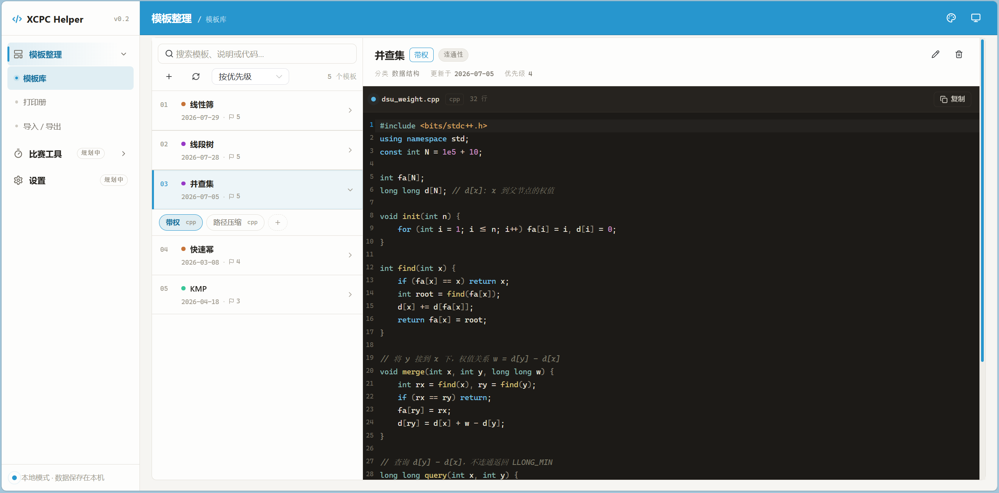
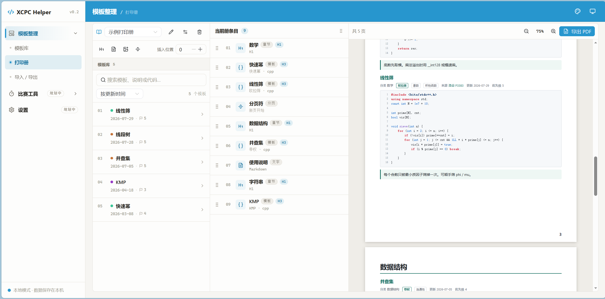

# XCPC Helper

面向 XCPC 竞赛选手的本地训练辅助工具：管理你的算法模板库，并把模板编排成可以打印带赛场的册子。

本地运行、离线可用、数据都在你自己电脑上，无需注册登录。

## 功能一览

我们致力于为算法竞赛选手提供强大、便捷的服务。

目前，项目还在开发初期阶段，我们会在后续更新更多更好的功能。以下是已实现的功能说明。

### 模板库

按「分类 / 模板 / 版本」三级组织你的算法模板，一个模板可以挂多个版本（不同语言、不同变体）。

- 全文检索：支持中文关键词，可按分类、标签筛选，按更新时间或优先级排序
- 代码预览：语法高亮、一键复制
- 说明文档：Markdown 渲染，支持 LaTeX 数学公式
- 可视化编辑：在界面里直接增删改模板，也可以直接编辑文件，改动自动生效

### 打印册

把模板库中的模板拖进册子，和章节、自由文字、图片组合排版，实时预览分页效果，一键导出 PDF——ICPC 区域赛允许携带的纸质资料就靠它了。

- 块式编排：章节 / 模板 / 文字 / 图片 / 分页符，拖拽排序
- 自动排版：封面、带页码的目录、每模板一节
- 多套配置：可以保存「区域赛版」「校内赛版」等多本册子，随时重复导出

## 画面演示





## 快速上手

### 环境要求

- Windows（其他平台可自行尝试，未验证）
- Node.js ≥ 20
- Python 3.12+ 与 [uv](https://docs.astral.sh/uv/)

> 免安装的绿色压缩包正在筹备中，后续会发布在 Releases 页面，届时无需配置任何环境。

### 安装与启动

```powershell
# 1. 获取源码
git clone https://github.com/<你的用户名>/xcpc-helper.git
cd xcpc-helper

# 2. 一键安装依赖并构建（PowerShell）
scripts/dev.ps1

# 3. 启动
cd backend
uv run uvicorn --app-dir src main:app --host 127.0.0.1 --port 8000
```

浏览器访问 <http://127.0.0.1:8000> 即可使用。

### 桌面模式（可选）

想要独立的桌面窗口而不是浏览器页面：

```powershell
scripts/dev.ps1 -Desktop
uv run --directory backend --group desktop python desktop.py
```

## 添加自己的模板

模板就是一个文件夹：一份代码文件 + 一份 `README.md` 说明，放在 `backend/content/<分类>/<模板>/` 下即可，程序会自动发现，无需重启。

```
backend/content/
└── 图论/
    └── Tarjan缩点/
        ├── main.cpp
        └── README.md
```

`README.md` 开头用 YAML front matter 描述元信息：

```markdown
---
updated: 2026-07-05
tags: ['连通性']
source: '洛谷 P3367'
priority: 5
---

正文说明（Markdown，支持 $O(n)$ 公式）……
```

也可以直接在界面上可视化编辑，两种方式完全等价。多版本模板（如 C++ / Python 两个实现）为每个版本建一个子目录即可。

## 常见问题

**模板改动后界面没更新？**
正常情况下文件监听会自动重建索引。如遇异常，可在诊断面板查看问题，或手动重建：

```powershell
curl -X POST http://127.0.0.1:8000/api/templates/reload
```

**我的数据存在哪里？**
模板在 `backend/content/`，打印册配置在 `backend/books/`，都是纯文本文件，直接备份这两个目录即可。

**端口被占用？**
启动命令中把 `--port 8000` 换成其他端口即可。

## 反馈与贡献

- 遇到问题或有功能建议：欢迎提 Issue
- 想贡献算法模板或代码：欢迎提 Pull Request

## 开发者文档

技术栈、目录结构、API 说明与开发规范见 [docs/development.md](docs/development.md)。

## 许可证

本项目的代码以 [MIT 许可证](LICENSE) 开源。
